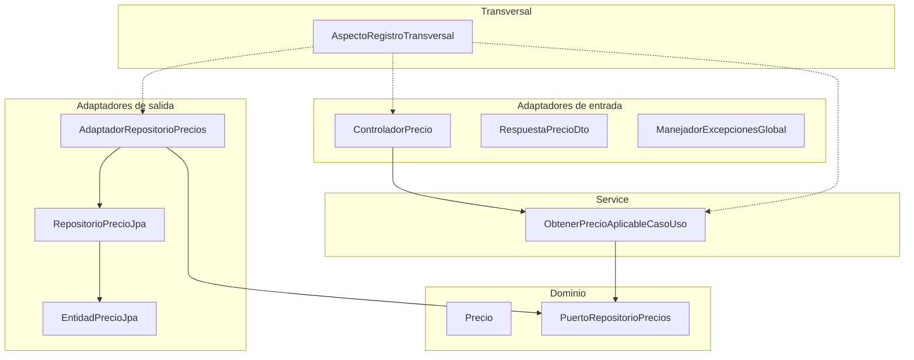
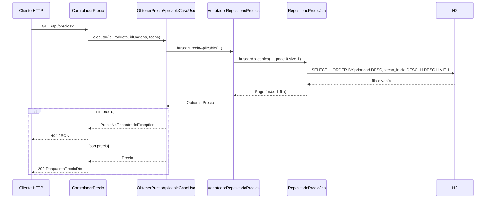

# Arquitectura hexagonal del servicio de precios

Este documento describe la organización **puertos y adaptadores** del proyecto `servicio-precios`, las responsabilidades de cada capa y el recorrido de una petición HTTP hasta la base de datos H2.

## 1. Introducción

La **arquitectura hexagonal** (Alistair Cockburn) separa el **núcleo de negocio** de los detalles técnicos (HTTP, JPA, consola, etc.). El dominio define **puertos** (interfaces); el mundo exterior implementa **adaptadores** que encajan en esos puertos. Así se cumple el **principio de inversión de dependencias (SOLID)**: el dominio no importa Spring ni JDBC.

En este servicio acotado, el núcleo es mínimo (un modelo `Precio` y un puerto de consulta), pero la estructura de paquetes escala si el producto crece.

## 2. Diagrama de capas y dependencias



Las dependencias **estables** apuntan hacia dentro: el controlador depende del caso de uso; el caso de uso depende solo del **puerto** (interfaz), no del JPA.

## 3. Capas y componentes

### 3.1. Dominio (`com.comercio.precios.dominio`)

| Elemento | Función |
|----------|---------|
| `Precio` | Objeto de valor / modelo con los datos de negocio devueltos al cliente (producto, cadena, tarifa, vigencia, importe, moneda). Inmutable y sin anotaciones de framework. |
| `PuertoRepositorioPrecios` | **Puerto de salida**: contrato para “dame el precio aplicable”. El dominio no sabe si la implementación es H2, Oracle o un mock en tests. |

No hay clases Spring aquí: el dominio permanece testeable y portable.

### 3.2. Capa de aplicación — paquete `service` (`com.comercio.precios.service`)

| Elemento | Función |
|----------|---------|
| `ObtenerPrecioAplicableCasoUso` | Orquesta la consulta: invoca al puerto y, si no hay resultado, lanza `PrecioNoEncontradoException`. Es un **bean** Spring (`@Service`) para inyección y AOP. |
| `PrecioNoEncontradoException` | Señal de negocio “sin tarifa aplicable”; el adaptador web la traduce a HTTP 404. |

La aplicación **no** manipula SQL ni JSON; solo tipos de dominio y excepciones de aplicación.

### 3.3. Adaptador de entrada — Web (`com.comercio.precios.adaptador.entrada.web`)

| Elemento | Función |
|----------|---------|
| `ControladorPrecio` | Mapea **GET** `/api/precios`, valida y parsea query params (`fechaAplicacion`, `idProducto`, `idCadena`), llama al caso de uso y devuelve `RespuestaPrecioDto`. |
| `RespuestaPrecioDto` | Contrato JSON de salida (record) separado del modelo de dominio. |
| `ManejadorExcepcionesGlobal` | `@RestControllerAdvice` que convierte `PrecioNoEncontradoException` en **404** con cuerpo `{ "mensaje": "..." }`. |

La documentación interactiva (**OpenAPI 3** y **Swagger UI**) la genera **springdoc-openapi** a partir del controlador y los DTOs anotados: es parte del **adaptador de entrada web** y de la configuración (`OpenApiConfig`), sin tocar dominio ni casos de uso. El contrato en JSON está en `/v3/api-docs`; en entorno local se puede probar el GET desde Swagger UI (véase el README).

### 3.4. Adaptador de salida — Persistencia (`com.comercio.precios.adaptador.salida.persistencia`)

| Elemento | Función |
|----------|---------|
| `EntidadPrecioJpa` | Mapeo ORM de la tabla `precios` (H2). |
| `RepositorioPrecioJpa` | Spring Data JPA: consulta con `ORDER BY prioridad DESC, fechaInicio DESC, id DESC` (desempate determinista) y **una sola página** (`PageRequest.of(0,1)`). La entidad define un **índice** compuesto `(id_cadena, id_producto, prioridad)` para consultas por cadena/producto. |
| `AdaptadorRepositorioPrecios` | Implementa `PuertoRepositorioPrecios`, traduce `EntidadPrecioJpa` → `Precio`. |

### 3.5. Configuración OpenAPI (`com.comercio.precios.configuracion`)

| Elemento | Función |
|----------|---------|
| `OpenApiConfig` | Bean `OpenAPI` con título, descripción y versión del API para Swagger UI y `/v3/api-docs`. Solo metadatos de presentación. |

### 3.6. Configuración transversal (`com.comercio.precios.configuracion.registro`)

| Elemento | Función |
|----------|---------|
| `AspectoRegistroTransversal` | **AOP**: registra entrada, salida, duración y errores de métodos públicos en `service` y `adaptador`. Mensajes en castellano. |
| `@SinRegistroAuditoria` | Excluye métodos concretos del aspecto si en el futuro se desea reducir ruido. |

El dominio **no** es interceptado (no es bean), coherente con hexagonal.

## 4. Flujo de una petición GET



## 5. Regla de negocio: precio aplicable

Para una tupla `(idProducto, idCadena, fechaAplicacion)`:

1. Se seleccionan filas donde `fechaAplicacion` está **entre** `fechaInicio` y `fechaFin` (inclusive).
2. Si hay varias, gana la de **mayor `prioridad`** (orden descendente, primera fila).

Esta regla está centralizada en la consulta JPA y se valida con los cinco tests de integración del enunciado.

## 6. Paquetes (referencia rápida)

```
com.comercio.precios
├── PreciosApplication
├── dominio
├── service
├── adaptador.entrada.web
├── adaptador.salida.persistencia
├── configuracion (p. ej. OpenApiConfig)
└── configuracion.registro
```

Para ejecutar y probar la API, consulta el [README](../README.md) del repositorio.
